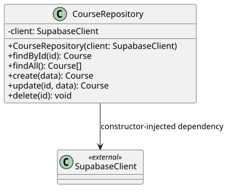
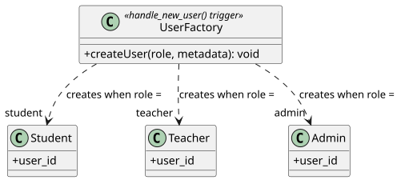
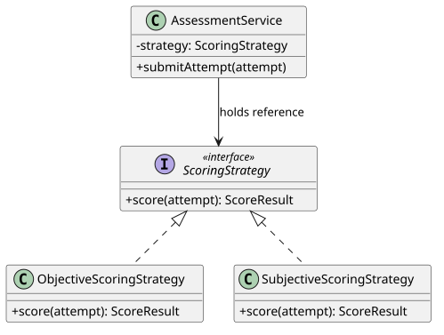
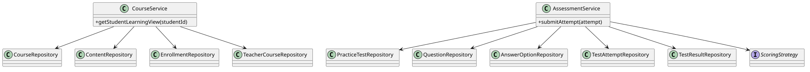
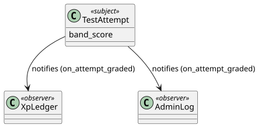

# Design Patterns

## IELTS-Beta-WebApp-Next

This document describes the five software design patterns implemented in the IELTS-Beta-WebApp-Next application.

The patterns are:

1. Repository Pattern
2. Factory Method Pattern
3. Strategy Pattern
4. Facade Pattern
5. Observer Pattern

Each pattern is used to separate responsibilities and improve the maintainability, extensibility, and structure of the application.

---

## 1. Repository Pattern

### Problem

The application communicates with PostgreSQL through Supabase. Placing database queries directly inside pages, route handlers, and business logic would tightly couple different parts of the application to the database layer.

This would make database-access logic difficult to maintain and reuse.

### Solution

The Repository Pattern encapsulates database-access operations inside dedicated repository classes.

Higher-level services can request data through repository methods without directly constructing Supabase queries.

### Implementation

The repository layer is located at:

```text
src/lib/repositories/
````

Representative repositories include:

* `course.repository.ts`
* `content.repository.ts`
* `enrollment.repository.ts`
* `teacher-course.repository.ts`
* `practice-test.repository.ts`
* `question.repository.ts`
* `answer-option.repository.ts`
* `test-attempt.repository.ts`
* `test-result.repository.ts`
* `live-class.repository.ts`
* `announcement.repository.ts`
* `support-ticket.repository.ts`

A representative `CourseRepository` provides operations such as:

```text
findById()
findAll()
create()
update()
delete()
```

The repository receives a `SupabaseClient` dependency and encapsulates the corresponding database operations.

### Benefits

* Separates data-access logic from application logic
* Reduces coupling to Supabase
* Provides reusable data-access operations
* Improves maintainability
* Makes the data layer easier to test

### UML Diagram



**Diagram:** `docs/assets/diagrams/repository-pattern.svg`

---

## 2. Factory Method Pattern

### Problem

The application supports different user roles:

* Student
* Teacher
* Admin

Creating a user requires creating the appropriate role-specific database record in addition to the authentication account.

Duplicating this logic throughout the authentication flow would make user creation difficult to maintain.

### Solution

The Factory Method Pattern centralizes role-specific user creation.

The database function `handle_new_user()` determines the user's role and creates the appropriate role-specific record.

### Implementation

The implementation is located in:

```text
supabase/migrations/0002_user_factory.sql
```

The main creation function is:

```text
handle_new_user()
```

The function is triggered when a new user is created through Supabase Auth.

The creation flow is:

```text
New Auth User
     │
     ▼
handle_new_user()
     │
     ├── Student
     ├── Teacher
     └── Admin
```

### Benefits

* Centralizes user creation
* Avoids duplicated role-specific creation logic
* Keeps authentication and application records synchronized
* Makes role-specific creation easier to extend

### UML Diagram



**Diagram:** `docs/assets/diagrams/factory-method-pattern.svg`

---

## 3. Strategy Pattern

### Problem

Different IELTS skills require different scoring approaches.

Objective assessments such as Listening and Reading can be automatically evaluated, while subjective assessments such as Writing and Speaking require a different evaluation process.

A single large conditional scoring implementation would become difficult to maintain as additional assessment types are introduced.

### Solution

The Strategy Pattern encapsulates different scoring algorithms behind a common interface.

The appropriate strategy can be selected according to the assessment skill.

### Implementation

The scoring implementation is located at:

```text
src/lib/scoring/strategy.ts
```

The main components are:

* `ScoringStrategy`
* `ObjectiveScoringStrategy`
* `SubjectiveScoringStrategy`
* `strategyFor(skill)`

The strategies are used by:

```text
src/lib/services/assessment-service.ts
```

`AssessmentService` works with the `ScoringStrategy` abstraction rather than depending directly on a specific scoring implementation.

### Benefits

* Separates scoring algorithms
* Reduces conditional complexity
* Makes scoring behavior easier to extend
* Allows different assessment types to use different strategies

### UML Diagram



**Diagram:** `docs/assets/diagrams/strategy-pattern.svg`

---

## 4. Facade Pattern

### Problem

Some application operations require coordination between multiple repositories.

For example, constructing a student's learning view may require information from courses, content, enrollments, and teacher-course assignments.

Directly coordinating these repositories from individual pages would make application logic unnecessarily complex.

### Solution

The Facade Pattern provides a simplified high-level interface over multiple underlying components.

The application services coordinate the required repositories and expose higher-level operations to their callers.

### Implementation

The main service implementations are:

```text
src/lib/services/course-service.ts
src/lib/services/assessment-service.ts
```

`CourseService` coordinates:

* `CourseRepository`
* `ContentRepository`
* `EnrollmentRepository`
* `TeacherCourseRepository`

For example:

```text
getStudentLearningView(studentId)
```

provides a higher-level operation for constructing the student's learning view.

`AssessmentService` coordinates assessment-related repositories and the scoring strategy when processing an assessment attempt.

### Benefits

* Simplifies complex application operations
* Hides repository coordination from callers
* Reduces duplicated orchestration logic
* Provides clear service-level operations

### UML Diagram



**Diagram:** `docs/assets/diagrams/facade-pattern.svg`

---

## 5. Observer Pattern

### Problem

When an assessment attempt is graded, other parts of the application may need to react to the event.

For example:

* XP can be recorded for the student
* An administrative log can be created

The core grading operation should not need to contain all of these secondary operations.

### Solution

The Observer Pattern allows additional operations to react to a state change without placing all of their logic inside the core grading operation.

In this implementation, PostgreSQL triggers are used to react when a test attempt receives a band score.

### Implementation

The implementation is located at:

```text
supabase/migrations/0007_observer.sql
```

The main database function is:

```text
on_attempt_graded()
```

The trigger reacts when a `test_attempts` record changes from an ungraded state to a graded state.

The resulting effects include:

```text
Test Attempt Graded
        │
        ├──► XpLedger
        │
        └──► AdminLog
```

### Benefits

* Separates grading from secondary side effects
* Reduces coupling between assessment, gamification, and logging
* Allows additional reactions to be introduced independently
* Uses database-level event handling for consistent execution

### UML Diagram



**Diagram:** `docs/assets/diagrams/observer-pattern.svg`

---

# Pattern Summary

| Pattern        | Purpose                                          | Main Implementation                          |
| -------------- | ------------------------------------------------ | -------------------------------------------- |
| Repository     | Encapsulates database-access operations          | `src/lib/repositories/`                      |
| Factory Method | Centralizes role-specific user creation          | `0002_user_factory.sql`                      |
| Strategy       | Encapsulates assessment scoring algorithms       | `src/lib/scoring/strategy.ts`                |
| Facade         | Simplifies coordination of multiple repositories | `course-service.ts`, `assessment-service.ts` |
| Observer       | Reacts to assessment grading events              | `0007_observer.sql`                          |

---

# UML Diagram Files

All UML diagrams are stored in:

```text
docs/assets/diagrams/
```

| Design Pattern | Diagram                                           |
| -------------- | ------------------------------------------------- |
| Repository     | `docs/assets/diagrams/repository-pattern.svg`     |
| Factory Method | `docs/assets/diagrams/factory-pattern.svg` |
| Strategy       | `docs/assets/diagrams/strategy-pattern.svg`       |
| Facade         | `docs/assets/diagrams/facade-pattern.svg`         |
| Observer       | `docs/assets/diagrams/observer-pattern.svg`       |

````